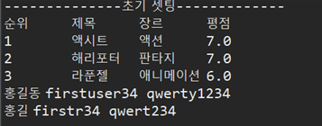
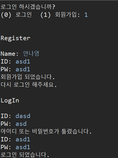
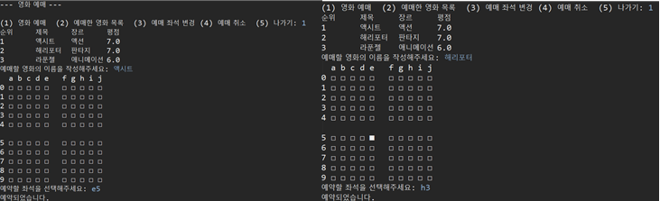
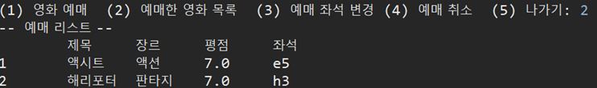
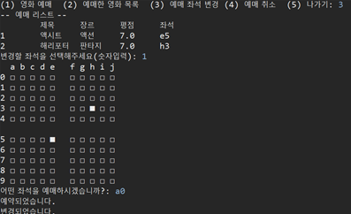
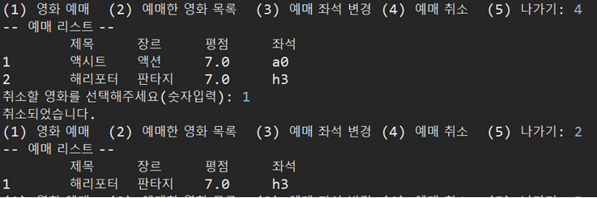
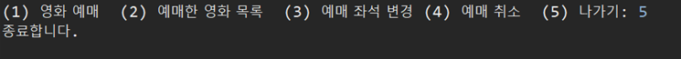

## 프로그램 주제와 예상 진도

### 프로그램 주제

영화관 프로그램 – 영화 추천, 예매, 자리 예약/변경 

### 프로그램 정보
- 변수: 별점(1~5/ double), 메뉴 선택 변수 등등
- 이용하는 알고리즘 예상: 탐색 알고리즘, 정렬 알고리즘 //정확히 어떤 알고리즘을 쓸 것인지 정하지 못하였습니다.
- 사용자 정보 클래스, 자리 예매/변경 클래스 등등

### 프로그램 내용
- 처음에 난수의 관객을 생성시켜 각각의 영화에 난수의 평점을 줍니다.
- 로그인을 할 것인지, 회원가입을 할 것인지 띄웁니다.
  - 로그인의 경우 기존에 저장해놓은 아이디 및 비밀번호로 로그인합니다.
  - 회원가입의 경우 아이디 및 비밀번호를 입력받고 아이디, 비밀번호 배열에 추가시킵니다.
- 영화를 예매할 것인지, 예매 표를 변경할 것인지, 표를 취소할 것인지 선택합니다.
  - 예매를 선택한 경우
    - 생성시킨 관객들이 입력한 평점에 따라 영화를 띄웁니다. (영화 장르, 영화 이름, 평점, 관객 수 등)
    - 영화를 선택하면 시간 및 자리를 선택하여 영화를 예매할 수 있도록 도웁니다.
  - 예매 표 변경을 선택한 경우
    - 예매한 표 목록을 보여줍니다.
    - 선택한 표의 자리를 변경할 수 있도록 도웁니다.
  - 예매 표 취소를 선택한 경우
    - 예매한 표 목록을 보여줍니다.
    - 선택한 표의 자리를 취소할 수 있도록 도웁니다.

## 주차별 프로그램 예상진도

<table>
  <tr>
    <td colspan = 3>주차</td>
    <td colspan = 4>내용</td>
  </tr>
  <tr>
    <td colspan = 3>6주차</td>
    <td colspan = 4, rowspan = 2>프로그램 주제 및 예상 진도 작성 (시험기간이므로)</td>
  </tr>
  <tr>
    <td colspan = 3>7주차</td>
  </tr>
  <tr>
    <td colspan = 3>8주차</td>
    <td colspan = 4>사용자의 정보(아이디, 비밀번호 등등)를 저장하는 클래스와 영화 정보를 저장하는 클래스, 사용자 목록, 예매 표 목록 등 구현</td>
  </tr>
  <tr>
    <td colspan = 3>9주차</td>
    <td colspan = 4>난수의 관객을 생성시켜 난수의 평점을 주는 함수와 영화 목록을 띄우는 프로그램을 작성.</td>
  </tr>
  <tr>
    <td colspan = 3>10주차</td>
    <td colspan = 4>로그인 및 회원가입 기능 구현.</td>
  </tr>
  <tr>
    <td colspan = 3>11주차</td>
    <td colspan = 4>자리 예약 및 변경, 취소 기능 구현.</td>
  </tr>
  <tr>
    <td colspan = 3>12주차</td>
    <td colspan = 4>영화 목록을 평점에 따라 정렬하는 기능 구현.</td>
  </tr>
  <tr>
    <td colspan = 3>13주차</td>
    <td colspan = 4>영화를 예매하는 기능 구현.</td>
  </tr>
  <tr>
    <td colspan = 3>14주차</td>
    <td colspan = 4>오류 및 프로그램 수정.</td>
  </tr>
</table>

  

<h1>알고리즘 최종</h1>

<h3>프로그램 주제</h3>

영화관 프로그램 – 영화 추천, 예매, 자리 예약/변경 

<h3>프로그램 정보</h3>

<ul>
  <li>Book.java: 사용자가 예약한 좌석과 영화의 정보를 정의합니다.</li>
  <li>LogInRegister.java: 로그인과 회원가입을 합니다. 사용자 리스트에서 사용자를 검색하여 찾는 함수가 들어있습니다.</li>
  <li>Movie_Info.java: 영화의 이름, 장르, 별점 등의 정보를 정의합니다.</li>
  <li>Movie.java: 초기 영화 정보와 사용자를 셋팅하고 영화를 예매합니다.</li>
  <li>MovieList.java: 영화 목록을 정의합니다.</li>
  <li>Seat.java: 좌석을 예약합니다. </li>
  <li>User_Info.java: 사용자의 아이디, 비밀번호, 이름 등의 정보를 저장합니다.</li>
  <li>UserList.java: 사용자 리스트를 정의합니다.</li>
</ul>

<h3>프로그램 내용</h3>

- 처음에 난수의 관객을 생성시켜 각각의 영화에 난수의 평점을 줍니다.
- 로그인을 할 것인지, 회원가입을 할 것인지 띄웁니다.
  - 로그인의 경우 기존에 저장해놓은 아이디 및 비밀번호로 로그인합니다.
  - 회원가입의 경우 아이디 및 비밀번호를 입력받고 아이디, 비밀번호 배열에 추가시킵니다.
- 영화를 예매할 것인지, 예매 표를 변경할 것인지, 표를 취소할 것인지 선택합니다.
  - 예매를 선택한 경우
    - 생성시킨 관객들이 입력한 평점에 따라 영화를 띄웁니다. (영화 장르, 영화 이름, 평점, 관객 수 등)
    - 영화를 선택하면 시간 및 자리를 선택하여 영화를 예매할 수 있도록 도웁니다.
  - 예매 영화 목록을 선택한 경우 예매한 영화와 좌석 리스트를 보여줍니다.
  - 예매 표 변경을 선택한 경우
    - 예매한 표 목록을 보여줍니다.
    - 선택한 표의 자리를 변경할 수 있도록 도웁니다.
  - 예매 표 취소를 선택한 경우
    - 예매한 표 목록을 보여줍니다.
    - 선택한 표의 자리를 취소할 수 있도록 도웁니다.

<h3>실행결과</h3>

<h4>1. 초기 셋팅</h4>

<h4>2. 로그인 및 회원가입</h4>

<h4>3. 영화 예매</h4>

<h4>4. 예매한 영화 목록</h4>

<h4>5. 예매 좌석 변경</h4>

<h4>6. 예매 취소</h4>

<h4>7. 종료</h4>

